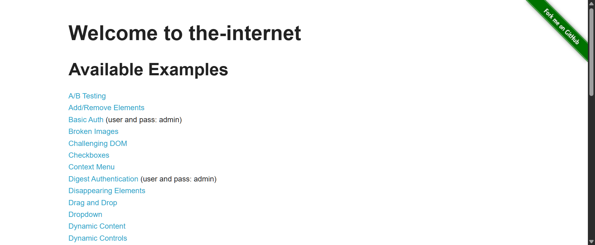

# Handling Browser Options Automation

A **Selenium WebDriver automation project** demonstrating how to configure and manage browser-specific options, SSL certificate handling, and WebDriver capabilities using **Java, Selenium, TestNG, and Maven**.

The project focuses on practical browser configuration techniques that are commonly required when building reliable web automation frameworks.

---

## 🚀 Project Overview

Browser configuration is an important part of Selenium automation, especially when tests need to run against different environments, handle SSL certificate warnings, or customize browser behavior.

This project demonstrates how to configure browser options and WebDriver settings programmatically instead of relying on manual browser configuration.

### Key Areas Covered

* Browser-specific WebDriver configuration
* Handling SSL certificate/security warnings
* Configuring browser options
* Selenium WebDriver initialization
* TestNG-based test execution
* Maven dependency management
* Reusable automation configuration concepts

---

## 🛠️ Tech Stack

| Technology                    | Purpose                       |
| ----------------------------- | ----------------------------- |
| **Java 25**                   | Programming language          |
| **Selenium WebDriver 4.48.0** | Browser automation            |
| **TestNG 7.12.0**             | Test execution and validation |
| **Maven**                     | Build & dependency management |
| **Commons IO 2.22.0**         | File and I/O utilities        |
| **Git / GitHub**              | Version control               |

---

## 📂 Project Structure

```text
Handling-BrowserOptions-Automation/
│
├── src/
│   └── main/
│       └── java/
│           └── ...
│
├── .idea/
├── .gitignore
├── pom.xml
├── README.md
└── screenshot.png
```

---

## 🔧 Browser Options

The project demonstrates the use of Selenium browser configuration through browser-specific option classes.

Typical Selenium browser configuration can be handled using:

```java
ChromeOptions
FirefoxOptions
EdgeOptions
```

These options allow automation scripts to control browser behavior before the WebDriver session starts.

For example:

```java
ChromeOptions options = new ChromeOptions();

options.setAcceptInsecureCerts(true);

WebDriver driver = new ChromeDriver(options);
```

This approach is useful when testing applications running in development, QA, staging, or other environments where SSL certificates may not be trusted by default.

---

## 🔐 SSL Certificate Handling

One of the primary concepts demonstrated in this project is handling **insecure SSL certificates** during browser automation.

Selenium provides browser capabilities that allow WebDriver to accept insecure certificates when required.

Example:

```java
ChromeOptions options = new ChromeOptions();

options.setAcceptInsecureCerts(true);
```

This can help automation tests access environments where browsers would otherwise display certificate/security warnings.

> **Note:** SSL certificate validation should not be disabled blindly in production environments. This configuration is primarily useful for controlled test environments where the behavior is intentional.

---

## 🧪 Test Execution

The project uses **TestNG** for test execution.

Tests can be executed through:

* IntelliJ IDEA
* Maven
* TestNG configuration
* CI/CD pipelines

### Run with Maven

```bash
mvn clean test
```

---

## 📦 Maven Dependencies

The project is managed using Maven.

Current core dependencies include:

```xml
<dependency>
    <groupId>org.seleniumhq.selenium</groupId>
    <artifactId>selenium-java</artifactId>
</dependency>

<dependency>
    <groupId>org.testng</groupId>
    <artifactId>testng</artifactId>
</dependency>

<dependency>
    <groupId>commons-io</groupId>
    <artifactId>commons-io</artifactId>
</dependency>
```

The project is configured for **Java 25**.

---

## 🎯 Learning Objectives

This project was created to strengthen practical understanding of:

* Selenium WebDriver configuration
* Browser capabilities
* Browser-specific options
* SSL certificate handling
* TestNG test execution
* Maven-based automation projects
* Java-based test automation
* Building reusable browser configuration logic

---

## 💡 Why Browser Options Matter in Automation

A robust automation framework should not depend entirely on default browser behavior.

Browser options can be used to control:

* SSL certificate acceptance
* Headless execution
* Browser arguments
* Download behavior
* Notifications
* Extensions
* Proxy configuration
* Browser preferences
* Security-related settings

Understanding these configurations helps create automation suites that behave consistently across different environments.

---

## 📸 Project Output



---

## 🔮 Possible Enhancements

Future improvements can include:

* [ ] Support for Chrome, Firefox, and Edge
* [ ] Cross-browser execution
* [ ] Headless browser execution
* [ ] WebDriverManager integration
* [ ] Config-driven browser selection
* [ ] Page Object Model
* [ ] TestNG parallel execution
* [ ] Extent/Allure reporting
* [ ] Jenkins CI/CD integration
* [ ] Docker-based browser execution
* [ ] Environment-specific configuration

---

## 👨‍💻 Author

**Kartik Ahalawat**

SDET | Quality Engineering & Test Automation | Java | Selenium | Playwright | API Testing

---

## 📌 Repository

**GitHub:**
https://github.com/Kartikahalawat/Handling-BrowserOptions-Automation

---

⭐ If you find this project useful, feel free to explore the repository and use it as a reference for Selenium browser configuration.

